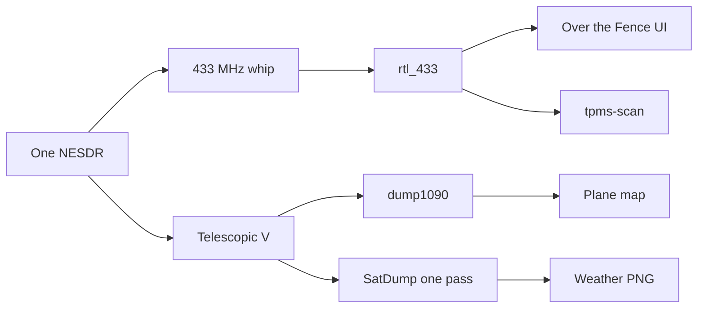

# How to read what your neighbourhood is already broadcasting

Weather stations on your street. Tyre readings from cars that are moving. Planes over your roof, with callsign and altitude. A picture of the Earth from a weather satellite you caught yourself.

One RTL-SDR. Two antennas, swapped by hand. You receive. You do not transmit.

Do this and you can name what is on the air around your house, because you heard it.

## What you will be able to do

- Find the weather stations in range and read temperature, humidity, and rain from the station, not from an app guessing your postcode. That tool is [Over the Fence](433%20scanner/README.md).
- Read tyre pressure and temperature from cars as they roll past. A parked car stays silent, because the sensors usually speak only while the wheel is turning. That tool is [`tpms-scan`](TPMS%20sensor%20scanner/README.md). This is not a gauge. Check the tyre with proper equipment before you let the reading change what you do.
- Watch the planes. Fit the longer antenna and you get callsign, altitude, and position for aircraft overhead, on a map that is yours.
- Catch one weather satellite. Borrow the stick for a single Meteor pass, keep a colour picture of the Earth about a kilometre per pixel and hundreds of kilometres wide, then put the stick back on the planes. That handoff is [`meteor-lease`](vhf%20shift/README.md).

## Try it before you buy the radio

You need Python 3.11+ and [uv](https://docs.astral.sh/uv/). These commands use a fake radio.

```bash
cd "433 scanner"
uv sync --dev
uv run ism-scan simulate
uv run pytest
```

```bash
cd "TPMS sensor scanner"
uv sync
uv run tpms-scan simulate
uv run tpms-scan replay examples/tpms-sample.jsonl
```

```bash
cd "vhf shift"
uv sync --dev
uv run meteor-lease pass --stub --yes
```

For the real street you also need `rtl_433` (weather and tyres), dump1090 (planes), or the SatDump app (the satellite). Each folder has a hardware note.

## One stick

A 433 MHz whip for the street. A telescopic V for the planes and the satellite. Only one program can hold the USB port at a time, so you do one of these jobs, then the next.



`meteor-lease` will not take the dongle unless you pass `--commit`. With `--commit`, it borrows the stick from the program named in `host.json` (`dump1090` or `ism-scan`) and gives it back when the pass is over.

You do not write a demodulator. `rtl_433`, dump1090, and SatDump do that, and they are not included here. The Python turns their output into something you can read, and it folds the extra copies `rtl_433` prints for one burst. The tests run without a dongle. Keep your recordings on your own machine. They can contain someone else's sensor id.

## What you still cannot do

- Listen to the street and the planes at the same time. One dongle does one job. A second stick is how you remove that limit.
- Name the ships. Nothing here decodes AIS.
- Hear cars that transmit at 315 MHz. The 433 MHz antenna does not cover them.
- Keep the street census after a restart. It stays in memory on purpose.

## Before you publish a recording

Do not post other people's sensor ids. The broadcasts are public. A recording that identifies a particular sensor or a particular car is still yours to keep private.

Copy `vhf shift/qth.example.json` to `qth.json` and `vhf shift/host.example.json` to `host.json` on the machine with the radio. Both real files are gitignored. Set `device_serial` from `rtl_test`. The plane map stays zoomed out until `qth.json` says where you are.

## Contributions

Issues are welcome. A pull request may be rewritten before it is merged.

## License

MIT. See [LICENSE](LICENSE). `rtl_433` is GPL-2.0-or-later and is run as a separate program.
