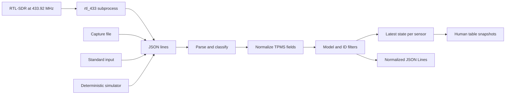

# feat: Build a TPMS sensor scanner

## Summary

Build a standalone, repo-ready Python project that turns `rtl_433` newline-delimited JSON into a useful view of nearby TPMS observations. The same command-line application will support a real SDR, standard input, recorded files, and deterministic simulation so the entire software path can be developed and verified before hardware arrives.

---

## Problem Frame

TPMS sensors use several vendor-specific radio protocols and may transmit infrequently while stationary. Implementing and validating the RF demodulators from scratch would require known sensors, captures, and test equipment. `rtl_433` already supports many TPMS families and provides a stable JSON integration boundary, allowing this project to focus on normalization, sensor state, operator experience, and repeatable verification.

---

## Assumptions

*This plan was authored without synchronous user confirmation. The items below are agent inferences that fill gaps in the input and remain visible for review.*

- Version one is a local, receive-only command-line tool rather than a mobile app or hosted service.
- The likely Australian target frequency is 433.92 MHz, but the frequency remains configurable because imported vehicles and sensors can use other bands.
- `rtl_433` owns RF capture and protocol decoding; this project consumes its JSON output rather than duplicating its decoder catalogue.
- Python 3.11 or newer and a zero-dependency standard-library runtime provide the cheapest and most portable starting point.
- Sensor IDs are sensitive location-adjacent identifiers, so observations remain local by default and documentation warns against scanning or publishing data without authorization.

---

## Requirements

- R1. Create the entire project under `TPMS sensor scanner/` with its own packaging, documentation, tests, and ignore rules so it can become a standalone repository later.
- R2. Accept TPMS observations from a managed `rtl_433` subprocess, standard input, and newline-delimited JSON capture files.
- R3. Include a deterministic simulator and representative fixtures that exercise the same ingestion path without SDR hardware.
- R4. Reject malformed, irrelevant, and incomplete RF events without terminating a long-running scan, while making rejection counts diagnosable.
- R5. Normalize supported `rtl_433` field variations into sensor ID, model, pressure, temperature, battery state, status, signal metadata, and observation time.
- R6. Track the latest observation per sensor, suppress older updates, calculate age, mark stale sensors, and support model and sensor-ID filters.
- R7. Provide human-readable table output and machine-readable JSON Lines output with stable, documented fields.
- R8. Provide operator commands for live scanning, fixture replay, simulation, and environment diagnosis, including actionable errors when `rtl_433` is absent or fails.
- R9. Remain receive-only, local-first, and transparent about RF/protocol, legal, privacy, and hardware limitations.
- R10. Prove behavior with unit tests and an end-to-end subprocess test that does not require physical hardware or network access.

---

## Scope Boundaries

- No RF transmission, sensor activation, pairing, cloning, or vehicle control.
- No claim that every vehicle or TPMS protocol is supported; compatibility is bounded by the installed `rtl_433` release and the receiver's frequency range.
- No cloud service, database, web dashboard, MQTT broker, or mobile application in version one.
- No inference of wheel position from signal strength; reliable wheel localization needs controlled proximity or additional hardware.
- No automated safety judgement or replacement for a calibrated tyre gauge.

### Deferred to Follow-Up Work

- Persistent history and charts: add only after real captures establish useful retention and sampling behavior.
- MQTT/Home Assistant output: add after the local event contract is stable.
- Native protocol decoders: add only for a confirmed unsupported sensor with shareable IQ captures.

---

## Context & Research

### Relevant Code and Patterns

- The parent repository is empty, so this project establishes the first local conventions.
- `rtl_433 -F json` provides a newline-delimited JSON boundary and supports multiple SDR backends and many named TPMS decoders.
- Unix filter behavior guides the input design: one event per line, diagnostics on standard error, structured output on standard output.

### Institutional Learnings

- No existing `docs/solutions/`, `AGENTS.md`, or application code was found.

### External References

- [`rtl_433` project and supported protocols](https://github.com/merbanan/rtl_433)
- [Homebrew `rtl_433` formula](https://formulae.brew.sh/formula/rtl_433)
- [`rtl_433` building guide](https://triq.org/rtl_433/BUILDING.html)
- [RTL-SDR Blog purchase and counterfeit guidance](https://www.rtl-sdr.com/tag/buy/)
- [Australian radio technical standards overview](https://www.acma.gov.au/technical-standards)

---

## Key Technical Decisions

- Use `rtl_433` as an adapter, not a library dependency: its CLI JSON interface isolates this permissively licensed application from RF backend and decoder churn.
- Keep the runtime dependency-free: `argparse`, `dataclasses`, `json`, and `subprocess` are sufficient; `pytest` and `ruff` are development-only dependencies managed by `uv`.
- Normalize conservatively: accept documented aliases for common fields, retain the original model and optional radio metadata, and drop events without both a TPMS classification and stable sensor ID.
- Separate ingestion, normalization, state tracking, rendering, and CLI orchestration so each failure boundary is independently testable.
- Emit snapshots for table mode and normalized events for JSON mode; this avoids ANSI terminal behavior contaminating machine-readable output.
- Use monotonic time for age/staleness decisions and UTC timestamps for serialization.

---

## Open Questions

### Resolved During Planning

- Implement native RF decoding or integrate an existing decoder: integrate `rtl_433`, because protocol breadth and hardware support dominate the value of a from-scratch decoder.
- Store observations by default: no; local transient state limits privacy exposure and keeps version one simple.
- Require hardware for acceptance: no; simulator, replay fixtures, and a fake `rtl_433` executable validate the complete process boundary.

### Deferred to Implementation

- Exact aliases present in less common TPMS decoders: preserve unknown source fields only in debug diagnostics and expand aliases when real captures demonstrate a need.
- Best live sample rate for a particular sensor: expose `rtl_433` passthrough arguments because some decoders document non-default sample rates.

---

## Output Structure

```text
TPMS sensor scanner/
├── .gitignore
├── LICENSE
├── README.md
├── pyproject.toml
├── docs/
│   ├── HARDWARE.md
│   ├── WORKAROUNDS.md
│   └── plans/
│       └── 2026-09-02-001-feat-tpms-sensor-scanner-plan.md
├── examples/
│   └── tpms-sample.jsonl
├── src/
│   └── tpms_scanner/
│       ├── __init__.py
│       ├── __main__.py
│       ├── cli.py
│       ├── models.py
│       ├── normalize.py
│       ├── render.py
│       ├── sources.py
│       └── tracker.py
└── tests/
    ├── fixtures/
    │   └── fake_rtl_433.py
    ├── test_cli.py
    ├── test_normalize.py
    ├── test_sources.py
    └── test_tracker.py
```

---

## High-Level Technical Design

> *This illustrates the intended approach and is directional guidance for review, not implementation specification. The implementing agent should treat it as context, not code to reproduce.*



Invalid lines and non-TPMS events increment diagnostics and continue. Source startup or process failures terminate with an actionable non-zero exit. Ctrl-C closes the child process and exits cleanly.

---

## Implementation Units

### U1. Establish the standalone project

**Goal:** Create a package layout, metadata, development tooling, licence, and project documentation baseline.

**Requirements:** R1, R9

**Dependencies:** None

**Files:**
- Create: `.gitignore`
- Create: `LICENSE`
- Create: `pyproject.toml`
- Create: `README.md`
- Create: `src/tpms_scanner/__init__.py`
- Create: `src/tpms_scanner/__main__.py`

**Approach:**
- Use a `src/` package layout, Python 3.11 minimum, `uv` development workflow, and console entry point.
- Keep the runtime dependency list empty.

**Patterns to follow:**
- Python Packaging User Guide `pyproject.toml` conventions.

**Test scenarios:**
- Integration: install the package in an isolated environment and invoke both the console script and module entry point.

**Verification:**
- Package metadata builds and the CLI help is reachable through both entry points.

### U2. Model and normalize TPMS observations

**Goal:** Convert varied `rtl_433` event dictionaries into one validated domain model.

**Requirements:** R4, R5, R9

**Dependencies:** U1

**Files:**
- Create: `src/tpms_scanner/models.py`
- Create: `src/tpms_scanner/normalize.py`
- Test: `tests/test_normalize.py`

**Approach:**
- Recognize TPMS using the event type and known TPMS model naming while avoiding unrelated 433 MHz traffic.
- Convert pressure aliases and units to kPa, normalize battery values, retain optional temperature and signal fields, and preserve UTC observation time.
- Return a typed rejection reason instead of raising on untrusted input.

**Execution note:** Implement normalization behavior test-first.

**Patterns to follow:**
- Pure-function parsing with immutable dataclasses and explicit validation results.

**Test scenarios:**
- Happy path: representative Toyota, Schrader, and generic TPMS fields normalize to stable values.
- Edge case: zero pressure and zero temperature remain valid rather than being treated as missing.
- Edge case: alternate pressure units convert to kPa with documented rounding.
- Error path: malformed JSON, unrelated weather events, and TPMS events without an ID are rejected with distinct reasons.
- Error path: booleans, numbers, and strings used by different battery fields normalize consistently.

**Verification:**
- Normalization tests cover accepted aliases, units, optional fields, and each rejection category.

### U3. Track, filter, and render sensor state

**Goal:** Maintain a deterministic latest-value view and expose useful human and machine output.

**Requirements:** R6, R7

**Dependencies:** U2

**Files:**
- Create: `src/tpms_scanner/tracker.py`
- Create: `src/tpms_scanner/render.py`
- Test: `tests/test_tracker.py`

**Approach:**
- Key sensors by model and ID, reject observations older than current state, and compute stale status only when rendering.
- Apply case-insensitive substring model filters and exact case-insensitive sensor-ID filters.
- Sort table rows stably and keep JSON serialization versioned and ANSI-free.

**Execution note:** Implement state transitions test-first.

**Patterns to follow:**
- Injected clock functions for deterministic age tests.

**Test scenarios:**
- Happy path: repeat observations update a single sensor row.
- Happy path: several sensors sort consistently and serialize with the documented schema.
- Edge case: an out-of-order observation does not replace newer state.
- Edge case: observations become stale exactly at the configured threshold.
- Error path: filters exclude nonmatching model or ID values without changing stored data.

**Verification:**
- Tests prove deduplication, ordering, staleness boundaries, filtering, and stable output.

### U4. Implement live, replay, standard-input, and simulated sources

**Goal:** Feed one ingestion contract from hardware and hardware-free sources.

**Requirements:** R2, R3, R4, R8

**Dependencies:** U2

**Files:**
- Create: `src/tpms_scanner/sources.py`
- Create: `examples/tpms-sample.jsonl`
- Create: `tests/fixtures/fake_rtl_433.py`
- Test: `tests/test_sources.py`

**Approach:**
- Stream lines lazily and cap diagnostics without buffering an unbounded scan.
- Launch `rtl_433` without a shell, pass frequency/output arguments explicitly, forward documented extra arguments, capture standard error, and terminate the child on shutdown.
- Generate deterministic examples including updates, unrelated events, and malformed input.

**Execution note:** Start with source lifecycle and subprocess failure tests.

**Patterns to follow:**
- Context-managed subprocess ownership and iterator-based input.

**Test scenarios:**
- Happy path: file, stdin, simulator, and fake subprocess each yield lines through the same interface.
- Edge case: blank lines and a final line without a newline are handled.
- Error path: missing file and missing `rtl_433` produce actionable errors.
- Error path: non-zero subprocess exit includes bounded standard-error context.
- Integration: early consumer shutdown terminates and reaps the fake child process.

**Verification:**
- Hardware-free tests cross the actual subprocess and stream boundaries without hangs or leaked children.

### U5. Orchestrate the command-line application

**Goal:** Deliver discoverable `scan`, `replay`, `simulate`, and `doctor` operator flows.

**Requirements:** R2, R3, R4, R6, R7, R8, R10

**Dependencies:** U2, U3, U4

**Files:**
- Create: `src/tpms_scanner/cli.py`
- Modify: `src/tpms_scanner/__main__.py`
- Test: `tests/test_cli.py`

**Approach:**
- Share ingestion options and diagnostics across commands.
- Keep standard output parseable in JSON mode and route warnings and summaries to standard error.
- Make finite replay/simulation print a final table; live table mode refreshes snapshots at a configurable interval.
- Make `doctor` check Python, executable discovery, version output, and optionally SDR visibility without requiring either to test simulation.

**Execution note:** Start with CLI contract tests, then wire each source.

**Patterns to follow:**
- `argparse` subcommands with a small orchestration layer and testable injected streams.

**Test scenarios:**
- Happy path: deterministic simulation emits two normalized sensors and reports rejection counters.
- Happy path: replay table and JSON modes produce the expected stable forms.
- Edge case: filters and stale threshold flow through the full CLI.
- Error path: invalid frequency, interval, or argument combinations fail during argument validation.
- Error path: malformed lines do not stop later valid events.
- Integration: the fake `rtl_433` executable is launched with the expected frequency and exits cleanly.
- Integration: Ctrl-C maps to a clean operator exit without a traceback.

**Verification:**
- End-to-end commands return documented exit codes and golden assertions prove stdout/stderr separation.

### U6. Document real-hardware setup and workarounds

**Goal:** Make the project reproducible for a user receiving hardware later and record every assumption used to finish without it.

**Requirements:** R1, R8, R9

**Dependencies:** U1, U5

**Files:**
- Modify: `README.md`
- Create: `docs/HARDWARE.md`
- Create: `docs/WORKAROUNDS.md`

**Approach:**
- Document macOS, Debian/Ubuntu, and Windows prerequisites; antenna placement; sensor wake behavior; capture/replay workflow; troubleshooting; and current purchase options.
- State that marketplace price, shipping, stock, and Prime eligibility are dynamic and must be confirmed at checkout for the user's postcode.
- Record physical verification steps separately from automated software evidence.

**Patterns to follow:**
- Copy-pasteable quick start followed by deeper troubleshooting and safety notes.

**Test scenarios:**
- Test expectation: none — documentation is checked by executing every local quick-start command during final verification.

**Verification:**
- A new user can run simulation first, install `rtl_433`, connect a compatible receiver, diagnose setup, and capture authorized local sensors using the docs alone.

---

## System-Wide Impact

- **Interaction graph:** Each source produces text lines; parser and normalizer isolate untrusted data; tracker owns transient state; renderers own output; the CLI owns process lifecycle.
- **Error propagation:** Per-line data errors become counters and warnings; source setup and child-process failures become concise terminal errors and non-zero exits.
- **State lifecycle risks:** State is memory-only, bounded by unique sensor identities during one process, and cannot leave partial persistent writes.
- **API surface parity:** Console-script and `python -m tpms_scanner` entry points invoke the same parser.
- **Integration coverage:** Replay and fake-subprocess tests cross the source, normalization, filter, state, and output layers.
- **Unchanged invariants:** The application never transmits RF, modifies a sensor, or writes observations unless the operator explicitly redirects output.

---

## Risks & Dependencies

| Risk | Mitigation |
|------|------------|
| Vehicle uses 315 MHz, 868 MHz, Bluetooth, or an unsupported protocol | Make frequency and extra decoder arguments configurable; document how to capture and report unsupported signals. |
| TPMS transmits only while moving or after activation | Explain wake behavior and test near a recently driven vehicle or use an appropriate service activation tool only if legally owned and needed. |
| Cheap SDR is counterfeit or unstable | Require RTL2832U plus R820T/R820T2/R860/R828-family tuner evidence and provide a trusted fallback. |
| `rtl_433` JSON differs by decoder/version | Conservative aliases, fixtures from several models, diagnostic rejection reasons, and retained model identity. |
| Nearby vehicle IDs create privacy concerns | Local-only defaults, no persistence, no network output, and explicit authorization guidance. |
| ANSI refresh corrupts pipelines | Human table mode and machine JSON mode have separate output behavior. |

---

## Documentation / Operational Notes

- Hardware prices and fulfilment will be documented with a research timestamp, not represented as permanent facts.
- Physical validation remains a checklist until a receiver and known TPMS sensor are available.
- A captured JSONL file, with sensor IDs redacted if shared, becomes the preferred regression fixture for a user's actual vehicle.

---

## Sources & References

- External docs: [`rtl_433`](https://github.com/merbanan/rtl_433)
- External docs: [Homebrew formula](https://formulae.brew.sh/formula/rtl_433)
- External docs: [RTL-SDR Blog buying guide](https://www.rtl-sdr.com/tag/buy/)
- External docs: [ACMA technical standards](https://www.acma.gov.au/technical-standards)
- Product research: [Core Electronics RTL2832U/R820T receiver](https://core-electronics.com.au/software-defined-radio-receiver-usb-stick-rtl2832-w-r820t.html)
- Product research: [Official RTL-SDR Blog V4L](https://www.rtl-sdr.com/product/rtl-sdr-blog-v4l-lite-r828s-rtl2832u-1ppm-tcxo-sma-software-defined-radio-dongle-only/)
